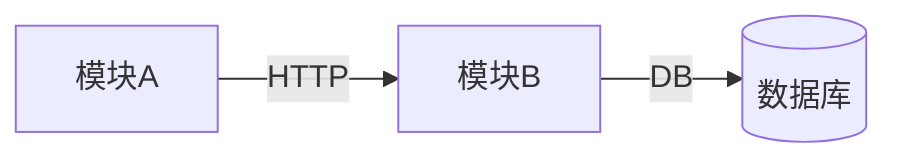

# 工程认知基线：{{PROJECT_NAME}}

> 生成时间：{{DATE}}
> 探索深度：Tier {{1|2|3}}
> 最后验证：{{DATE or NEVER}}

---

## §1 一页摘要

- **产品做什么**：（1-3 句）
- **技术栈与产品形态**：（单体 / 微服务 / 前后端分离 / 移动端…）
- **当前规模量级**：（代码行数 / 模块数 / 服务数，量级即可）

## §2 仓库地图

| 目录 | 职责 | 变更频率 | 备注 |
|------|------|---------|------|
| | | | |

> 每行一个「有独立职责的目录」，不展开到单文件级别。

## §3 模块边界与调用关系

> mermaid 图或分层列表；标注调用方向与协议（HTTP / gRPC / 直接引用 / MQ 等）。

## §4 入口与配置索引

| 类型 | 路径 | 说明 |
|------|------|------|
| 应用启动 | | |
| 路由注册 | | |
| 配置文件 | | |
| 环境变量 | | |

## §5 核心数据模型

> ER 概要或实体关系表格；含关键状态机（如有）。

| 实体 | 主要字段 | 关系 | 备注 |
|------|---------|------|------|
| | | | |

- **迁移方式**：（migration 工具 / 手动脚本 / UNKNOWN）

## §6 关键架构决策

> Tier 2+ 必填。无法从代码推导的「为什么」写在这里。

| 决策 | 选型 | 理由 | 备选 |
|------|------|------|------|
| | | | |

## §7 非显式约定

> Tier 2+ 必填。代码中分散存在但未成文的约定。

- **命名规范**：
- **分层策略**：
- **错误处理风格**：
- **日志规范**：

## §8 外部集成说明

> Tier 2+ 必填。

| 外部系统 | 协议 | 认证方式 | 关键路径 |
|----------|------|---------|---------|
| | | | |

## §9 已知技术债与风险

| 条目 | 严重程度 | 位置 | 说明 |
|------|---------|------|------|
| | | | |

> 无则写「无已知项」。

## §10 Open Questions

| 问题 | 来源 | 影响范围 |
|------|------|---------|
| | | |

> 未验证、Agent 无法获取、需人工补充的一切均进入此处。
> 部署拓扑、权限模型、历史决策等 Agent 通常拿不到的信息，探索时若未找到证据，也写在这里。

---

## 附录 A：关键文件索引

> ≤ 30 条。Tier 2+ 建议填写，Tier 3 必填。

| 路径 | 说明 |
|------|------|
| | |

## 附录 B：术语表

> 领域复杂时使用。Tier 3 建议填写。

| 业务术语 | 技术实体 | 说明 |
|----------|---------|------|
| | | |
